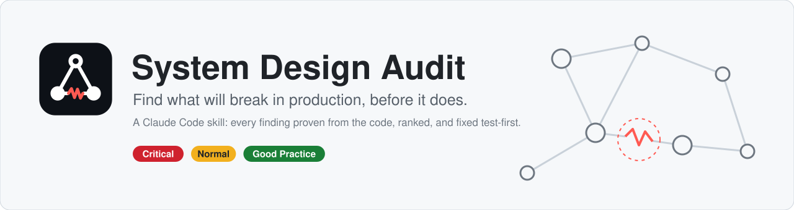
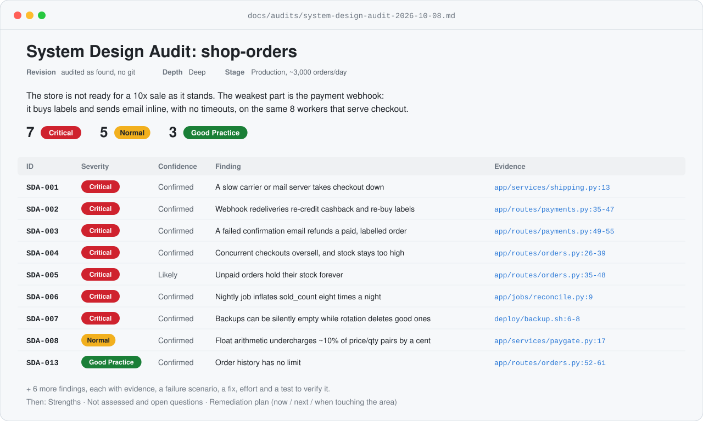
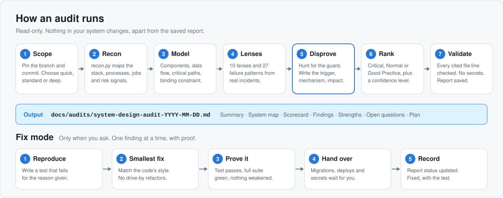
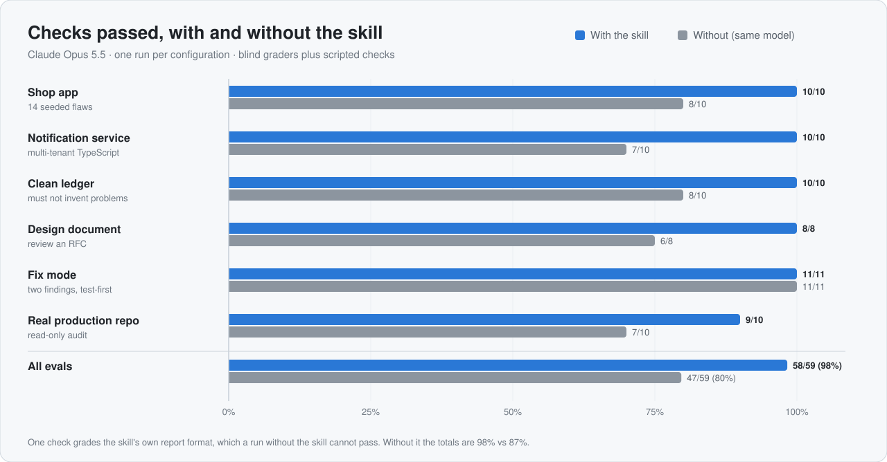

<p align="center">
  <picture>
    <source media="(prefers-color-scheme: dark)" srcset="assets/banner-dark.svg">
    
  </picture>
</p>

<p align="center">
  <a href="#install"></a>
  <a href="#works-with-any-stack"></a>
  <a href="#development"></a>
  <a href="#results"></a>
  <a href="LICENSE"></a>
</p>

<p align="center">
  <a href="#install">Install</a> ·
  <a href="#quick-start">Quick start</a> ·
  <a href="#what-you-get">What you get</a> ·
  <a href="#how-it-works">How it works</a> ·
  <a href="#severity-and-confidence">Severity</a> ·
  <a href="#fix-mode">Fix mode</a> ·
  <a href="#results">Results</a> ·
  <a href="#faq">FAQ</a>
</p>

**System Design Audit** is a skill for [Claude Code](https://claude.com/claude-code).
Point it at a repository, a folder of repositories or a design document, and it
tells you what will break in production:

- every problem is **proven from the code**, with `file:line` evidence and a
  concrete failure scenario;
- every problem is **ranked** Critical, Normal or Good Practice, so you know
  what to fix first;
- every problem comes with **the smallest fix that removes it**, and a test
  that proves the fix works.

When you ask, it also applies the fixes, one finding at a time, test-first.

> **The rule behind every finding:** a finding is a failure scenario backed by
> evidence, not a missing best practice.
>
> "No circuit breaker" is not a finding. "When the carrier API hangs, every
> checkout worker blocks on `shipping.py:13`, which has no timeout, and the
> site stops taking orders" is.

**Who it's for:** teams before a launch, a big sale or a funding round;
engineers inheriting a codebase; anyone who has been told "it works on my
machine" and wants to know what happens with two machines, two requests at
once, or a provider that retries.

## Install

Run these two commands inside Claude Code:

```
/plugin marketplace add khan-rustam/system-design-skill
/plugin install system-design-audit@system-design-audit
```

Or run them from your terminal:

```bash
claude plugin marketplace add khan-rustam/system-design-skill
claude plugin install system-design-audit@system-design-audit
```

That's all. The skill now works in **every repository you open** with Claude
Code, in any language, and nothing has to be added to the repositories
themselves.

The two helper scripts need Python 3.8 or newer, standard library only. There
is nothing to `pip install`.

### Share it with your team

**Option 1: through the plugin.** Inside the repository, run:

```bash
claude plugin marketplace add khan-rustam/system-design-skill --scope project
claude plugin install system-design-audit@system-design-audit --scope project
```

Then commit the `.claude/settings.json` these commands write. It declares
where the plugin comes from and turns it on for the project:

```json
{
  "extraKnownMarketplaces": {
    "system-design-audit": {
      "source": { "source": "github", "repo": "khan-rustam/system-design-skill" }
    }
  },
  "enabledPlugins": {
    "system-design-audit@system-design-audit": true
  }
}
```

A teammate who doesn't have the plugin yet runs the two install commands at
the top of this section once.

**Option 2: inside the repository.** Copy `skills/system-design-audit/` into
the repository's `.claude/skills/` folder and commit it. Everyone who clones
the repository then has the skill, with no install step. To update it later,
copy the folder again.

### Other ways to install

- **Just for you, without the plugin system:** copy `skills/system-design-audit/`
  into `~/.claude/skills/`.
- **claude.ai:** zip the `skills/system-design-audit` folder so that the zip's
  top level is that folder, containing `SKILL.md`. Then upload it as a custom
  skill in your claude.ai settings.

## Quick start

Open Claude Code in your project and ask in plain words. The skill loads by
itself for requests like these:

```text
audit the system design of this repo
is this ready for 10x traffic? rank what will break
check this django + celery + postgres repo for race conditions and duplicate jobs
review docs/rfc-042-inventory.md for architecture risks before we build it
fix SDA-002 and SDA-004 from docs/audits/system-design-audit-2026-10-08.md
we fixed last month's findings: did we fix everything?
```

You can also start it by name: type `/system-design-audit:system-design-audit`,
or ask *"use system-design-audit on this repo"*.

What happens next:

1. Claude records the commit it is auditing and picks a depth: quick,
   standard or deep.
2. It maps the system, reads the critical paths in full, and checks every
   lens (see [How it works](#how-it-works)).
3. It saves the report to `docs/audits/system-design-audit-YYYY-MM-DD.md` and
   doesn't commit it.
4. In chat, it gives you the verdict, the counts per severity, one line per
   Critical finding, and the report's path.

In the evals, an audit took between 16 and 38 minutes.

## What you get

<p align="center">
  <picture>
    <source media="(prefers-color-scheme: dark)" srcset="assets/report-preview-dark.svg">
    
  </picture>
</p>

<sub>A real report the skill wrote for the test shop in
<code>tests/fixtures/shop-orders</code>, shortened to fit.</sub>

Every report has the same sections, so you always know where to look:

| Section | What it tells you |
|---|---|
| **Header** | What was audited: the scope, the exact revision, the depth, and the stage it assumed (prototype, production, or regulated) |
| **Summary** | The verdict in plain words, the counts per severity, and the top risks |
| **System map** | The components, which one owns each piece of data, a data-flow diagram, the critical paths, and the *binding constraint* that really limits capacity |
| **Scorecard** | Each of the ten lenses rated Strong, Adequate, Weak or Not assessed |
| **Findings** | A table, then one section per finding (see the example below) |
| **Strengths** | What is already right, so nobody "fixes" it |
| **Not assessed and open questions** | What the audit couldn't see, and what to check |
| **Remediation plan** | What to do now, what to do next, and what to do when you're next in that area |

### One finding, in full

This is real output from the same report, unedited:

<details open>
<summary><b>SDA-004 · Critical · Concurrent checkouts oversell, and stock stays too high</b></summary>

- **Lens:** Data model & integrity
- **Confidence:** Confirmed
- **Evidence:** `app/routes/orders.py:26` reads `stock` outside any
  transaction. `:30-31` compares it in Python. `:36-39` then writes an
  **absolute** value, `SET stock = <stock read earlier> - qty`, in a later
  transaction with no row lock and no condition.
  `migrations/001_init.sql:26` has no `CHECK (stock >= 0)`.
- **Failure scenario:** Two customers order the last unit of a sale item
  within the same few milliseconds. Both read `stock = 1`, both pass the
  check, and both write `stock = 0`. There are two orders for one unit.
  With stock 5, orders for 2 and 3 units both read 5, then write 3 and 2,
  and the product still shows 2 units for sale after 5 were sold. Because
  the write is absolute, the race loses decrements and leaves stock too
  high, never negative. A `CHECK` constraint alone would never fire. Flash
  deals concentrate exactly this traffic.
- **Recommendation:** One conditional, relative update inside the order
  transaction. Zero rows means sold out:
  ```python
  with transaction() as cur:
      cur.execute(
          "UPDATE products SET stock = stock - %s WHERE id = %s AND stock >= %s RETURNING price",
          (qty, product_id, qty))
      row = cur.fetchone()
      if row is None:
          abort(409, "out of stock")          # rolls back the transaction
      total = row["price"] * qty              # Decimal (see SDA-008)
      cur.execute("INSERT INTO orders ...")
  ```
  Add `ALTER TABLE products ADD CONSTRAINT products_stock_nonneg CHECK (stock >= 0);`
  as a backstop.
- **Effort:** S
- **Verify:** A test against a real PostgreSQL fires two concurrent
  `POST /orders` for a product with stock 1. Exactly one returns 201 and one
  returns 409, and stock ends at 0. Repeat with stock 5 and quantities 2
  and 3: both succeed and stock ends at 0.
- **Status:** Open

</details>

## How it works

<p align="center">
  <picture>
    <source media="(prefers-color-scheme: dark)" srcset="assets/how-it-works-dark.svg">
    
  </picture>
</p>

1. **Scope.** It records the branch and commit, and whether the checkout is
   behind the main branch. An audit of a stale branch reports bugs that
   production fixed weeks ago.
2. **Recon.** `scripts/recon.py` lists the languages, frameworks, process
   managers, scheduled jobs, deploy files and *risk signals*: places worth
   reading, such as a network call with no timeout. Signals are leads, never
   findings.
3. **Model.** It writes down the components, who owns each piece of data, the
   data flow, the critical paths (money, identity, the core user journey),
   and the binding constraint. That constraint is often a worker count, a
   connection limit or a provider quota, not CPU or RAM.
4. **Lenses.** It works through [ten lenses](#what-it-checks) and a catalogue
   of [27 failure patterns from real incidents](skills/system-design-audit/references/failure-patterns.md).
5. **Disprove.** For each candidate finding it looks for the guard first: a
   database constraint, middleware, a framework default, the caller. A
   finding survives only if it can name the trigger, the mechanism and the
   impact, with evidence.
6. **Rank.** It assigns a severity and a confidence level using a written
   rubric with calibration examples (see [below](#severity-and-confidence)).
7. **Validate.** It re-opens every cited line. Then `scripts/validate_report.py`
   checks the report's structure, checks that the counts match, rejects
   anything that looks like a live credential, and confirms that **every
   cited `file:line` exists**.

Three habits keep the report short and trustworthy:

- **Precision over volume.** One false Critical costs a report its
  credibility, so a finding without a failure scenario is dropped, downgraded
  to Good Practice, or moved to open questions.
- **Deliberate decisions are respected.** If the code or docs explain a
  trade-off, the skill doesn't "fix" it.
- **Fixes are right-sized.** No Kubernetes, microservices or message queue
  is recommended where one conditional `UPDATE` removes the failure.

## Severity and confidence

| Severity | Meaning | Example | When to fix |
|---|---|---|---|
| 🔴 **Critical** | A normal event (a retry, two requests at once, a deploy, a slow provider) causes data loss, wrong money, a security breach, an outage that needs a human, or silently wrong results | A payment webhook with no event-ID check credits the wallet on every redelivery | Before the next release |
| 🟡 **Normal** | A real defect with bounded or recoverable impact | `GET /orders` returns every order a user has ever placed, with no limit | In planned work |
| 🟢 **Good Practice** | No current failure scenario; it makes the system easier to run or change | No request IDs in the logs | When you're next in that area |

Severity moves with the facts. **Silent** failures rank above loud ones,
because a crash gets fixed and a wrong number ships for months. **Money,
identity and irreversible actions** push severity up. A failure that needs
several rare faults at once, or a guard that already limits the damage, pulls
it down.

Each finding also gets a **confidence** level:

| Confidence | Meaning |
|---|---|
| **Confirmed** | The trigger, mechanism and impact were traced in code that was read |
| **Likely** | One step depends on something the audit couldn't see, such as a runtime setting; the report names it |
| **Needs verification** | Plausible but unproven; the report gives the exact check to run |

A finding that rests on something unseen is ranked by what the evidence
proves, not by the worst case. The full rubric is in
[`references/severity.md`](skills/system-design-audit/references/severity.md).

## What it checks

| Lens | The kind of question it asks |
|---|---|
| Architecture & boundaries | Does each important entity have exactly one source of truth? Do services read each other's tables? |
| Data model & integrity | Which rules does the database enforce, and which are only hoped for in application code? |
| Reliability & failure handling | Does every network call have a deadline? Are retries bounded and limited to safe operations? |
| Concurrency, jobs & async work | How many processes run this code? Can two runs of the same job overlap? |
| Scalability, performance & capacity | What actually caps throughput? Are user-controlled sizes bounded? |
| API & integration contracts | Are webhooks idempotent? Will an API change break a consumer in another repo? |
| Security architecture | Is authorization checked where the data is? Where do secrets live, and can they be rotated? |
| Observability | Can an operator tell whether it's working right now, and what happened to one request? |
| Deployment, operations & recovery | Can a bad deploy be rolled back? Has a backup ever been restored? |
| Maintainability & evolvability | Do tests pin the transitions that move money or grant access? |

The questions, where to look and what usually turns out to be real are in
[`references/lenses.md`](skills/system-design-audit/references/lenses.md).

<details>
<summary><b>The 27 failure patterns</b>: bugs that look like correct code</summary>

Each one caused a real production incident. The catalogue says what it looks
like, why it breaks, how to spot it, and how to fix it.

**Data & state**
[1. The upsert that adds a recount](skills/system-design-audit/references/failure-patterns.md#1-the-upsert-that-adds-a-recount) ·
[2. The non-fatal persist that never succeeds](skills/system-design-audit/references/failure-patterns.md#2-the-non-fatal-persist-that-never-succeeds) ·
[3. Check-then-act on a scarce quantity](skills/system-design-audit/references/failure-patterns.md#3-check-then-act-on-a-scarce-quantity) ·
[4. The side effect that rewrites the core state](skills/system-design-audit/references/failure-patterns.md#4-the-side-effect-that-rewrites-the-core-state) ·
[5. The dual write](skills/system-design-audit/references/failure-patterns.md#5-the-dual-write)

**Reliability**
[6. The call with no deadline](skills/system-design-audit/references/failure-patterns.md#6-the-call-with-no-deadline) ·
[7. Fixing pool exhaustion with a bigger pool](skills/system-design-audit/references/failure-patterns.md#7-fixing-pool-exhaustion-with-a-bigger-pool) ·
[8. The misclassified error that triggers the wrong recovery](skills/system-design-audit/references/failure-patterns.md#8-the-misclassified-error-that-triggers-the-wrong-recovery) ·
[9. The backoff that speeds up](skills/system-design-audit/references/failure-patterns.md#9-the-backoff-that-speeds-up) ·
[10. The retry multiplier](skills/system-design-audit/references/failure-patterns.md#10-the-retry-multiplier)

**Concurrency**
[11. The lease that isn't renewed on one path](skills/system-design-audit/references/failure-patterns.md#11-the-lease-that-isnt-renewed-on-one-path) ·
[12. Release-then-acquire](skills/system-design-audit/references/failure-patterns.md#12-release-then-acquire) ·
[13. The scheduler inside every web worker](skills/system-design-audit/references/failure-patterns.md#13-the-scheduler-inside-every-web-worker) ·
[14. Concurrent whole-table maintenance](skills/system-design-audit/references/failure-patterns.md#14-concurrent-whole-table-maintenance) ·
[15. One credential, many holders](skills/system-design-audit/references/failure-patterns.md#15-one-credential-many-holders) ·
[16. The dev worker that mails production](skills/system-design-audit/references/failure-patterns.md#16-the-dev-worker-that-mails-production) ·
[27. The foreign-key lock that defeats lock ordering](skills/system-design-audit/references/failure-patterns.md#27-the-foreign-key-lock-that-defeats-lock-ordering)

**Contracts & capacity**
[17. The implicit positional contract](skills/system-design-audit/references/failure-patterns.md#17-the-implicit-positional-contract) ·
[18. The maximum that is never enforced](skills/system-design-audit/references/failure-patterns.md#18-the-maximum-that-is-never-enforced) ·
[19. The scarce resource taken before the cache check](skills/system-design-audit/references/failure-patterns.md#19-the-scarce-resource-taken-before-the-cache-check) ·
[20. Capacity measured against the wrong constraint](skills/system-design-audit/references/failure-patterns.md#20-capacity-measured-against-the-wrong-constraint)

**Operations**
[21. The backup that succeeds at producing nothing](skills/system-design-audit/references/failure-patterns.md#21-the-backup-that-succeeds-at-producing-nothing) ·
[22. The deploy that isn't running](skills/system-design-audit/references/failure-patterns.md#22-the-deploy-that-isnt-running) ·
[23. The deploy script that rewrites itself](skills/system-design-audit/references/failure-patterns.md#23-the-deploy-script-that-rewrites-itself) ·
[24. The hidden cross-service database](skills/system-design-audit/references/failure-patterns.md#24-the-hidden-cross-service-database) ·
[25. Secrets on the command line](skills/system-design-audit/references/failure-patterns.md#25-secrets-on-the-command-line) ·
[26. The audit of the wrong revision](skills/system-design-audit/references/failure-patterns.md#26-the-audit-of-the-wrong-revision)

</details>

## Four modes

| Mode | Ask it to | What it does | Changes code? |
|---|---|---|---|
| **Audit** | "audit / review / check the system design of …" | The full audit above; report saved to `docs/audits/` | No |
| **Design review** | "review this design doc / RFC" | The same lenses applied to a document; decisions the doc hasn't made yet become findings | No |
| **Fix** | "fix SDA-003", "fix the Critical findings" | One finding per change: reproduce, smallest fix, prove, record | Yes |
| **Re-audit** | "did we fix everything?" | Re-checks an earlier report: each finding is Fixed, Open, Regressed or Stale | No |

It also audits **several repositories as one product**. Point it at the folder
that holds them: the seams between repositories, such as shared databases,
API contracts and shared credentials, are where the worst defects hide.

## Fix mode

An audit never changes your system. Fixing is a separate step that you ask
for, after you have seen the whole picture. For each finding:

1. **Reproduce.** It writes a test (or a script or query) that encodes the
   failure scenario: two concurrent checkouts, the same webhook delivered
   twice, an upstream that never answers. It runs it and **watches it fail**.
2. **Make the smallest correct change**, in the code's own style, with no
   drive-by refactors.
3. **Prove it.** The reproduction passes, the full suite passes, and no
   existing check, test or constraint is weakened to get there.
4. **Hand over what is risky.** These are prepared, then left for you:
   backfills on real data, deploys, infrastructure changes, contract changes
   other teams consume, product decisions hidden in a fix, and anything
   touching secrets.
5. **Record it.** The finding's status in the report becomes, for example,
   `Fixed — tests/test_checkout.py::test_concurrent_last_unit (2026-10-08)`.

The recipes it draws on are in
[`references/remediation.md`](skills/system-design-audit/references/remediation.md):
idempotent webhooks, atomic conditional updates, deadlines on every call,
retries done once, outboxes, single-run schedulers, leases, verified backups
and zero-downtime migrations.

## Safety and privacy

- **Read-only audits.** The only file an audit writes is the report, and it
  doesn't commit it. If you refuse the write, Claude returns the report as
  text instead and says it was not saved.
- **No secrets in, no secrets out.** `recon.py` never opens real `.env` files
  (only `.env.example` and similar) and redacts values that look secret.
  `validate_report.py` rejects any report that contains something resembling
  a live credential.
- **Nothing runs, nothing leaves your machine.** The scripts don't start your
  services and make no network calls. `recon.py` runs only read-only local
  `git` commands (status, log, rev-parse) and never fetches.

## Works with any stack

The method is language-agnostic. The recon script recognises Python,
JavaScript/TypeScript, Go, Java/Kotlin, Ruby, PHP, Rust, Dart and .NET
manifests, plus Docker, Compose, Kubernetes, systemd, PM2, Terraform and
common CI files.

## Results

<p align="center">
  <picture>
    <source media="(prefers-color-scheme: dark)" srcset="assets/benchmark-dark.svg">
    
  </picture>
</p>

It was benchmarked on Claude Opus 5.5 with Anthropic's skill-creator eval
harness. Each eval ran once with the skill and once without it, using the same
model. The grading came in two parts:

- **A script** checked the mechanical points: the report exists, every cited
  `file:line` exists, no secrets appear, the audited repository is untouched,
  and in fix mode the new tests pass and also fail against the original code.
- **Blind graders** checked the rest. Each grader saw both reports with the
  labels removed, plus the answer key.

| Eval | What it tests | With skill | Without |
|---|---|---|---|
| Shop app | Flask shop with 14 seeded design flaws | 10/10 | 8/10 |
| Notification service | multi-tenant TypeScript service | 10/10 | 7/10 |
| Clean ledger | a well-designed system: must not invent problems | 10/10 | 8/10 |
| Design document | review of a ride-dispatch design doc | 8/8 | 6/8 |
| Fix mode | fix two findings test-first | 11/11 | 11/11 |
| Real production repo | read-only audit of a private production worker | 9/10 | 7/10 |
| **All evals** | | **58/59 (98%)** | **47/59 (80%)** |

**Where the skill helped**

- **Calibration.** It kept severities honest: no inflated Criticals on the
  well-designed ledger.
- **Honest coverage.** It said plainly what it read in depth, what it sampled
  and what it didn't assess.
- **Evidence.** It cited `file:line` throughout. The run without the skill
  reviewed the design document without citing a single line.
- **Unseen dependencies.** On the real repo it named the check for 3 of the 5
  Critical findings that depended on something it couldn't see. Without the
  skill, the figure was 2 of 7.
- **No leaked secrets.** The run without the skill copied a database URL,
  password included, into its report.

**Read the numbers with care**

- **One run per configuration.** A difference of one check is noise.
- **One check favours the skill by design.** It grades the skill's own report
  format. Without that check the totals are 98% vs 87%. On the blind-graded
  checks alone, they are 32/33 vs 28/33.
- **It doesn't find more problems.** On the ledger, the run without the skill
  found more of the known issues (8 vs 6 of 10). On the real repo, each run
  found serious defects that the other missed. The skill improves structure
  and judgement; it doesn't guarantee completeness.
- **It costs more.** Expect about 40% more time and tokens: a run averaged 22
  minutes and 265k tokens, against 16 minutes and 187k without the skill.
- **One finding is no longer independent evidence.** The ledger's deadlock is
  now described in failure pattern 27, so finding it proves less than it did.

**Triggering.** These checks ran in a clean session that had only Claude
Code's built-in skills and this plugin.

- The skill loaded for 10 of 10 audit, review and fix requests.
- It stayed out of 10 of 10 near-misses: a PR diff review, one failing test,
  an interview question, a diagram, an OWASP review, feature work, explaining
  code, a UI redesign, writing unit tests and a concept question.

The eval definitions, answer keys and grading script are in [`evals/`](evals/).

## Project layout

```text
skills/system-design-audit/
├── SKILL.md                     the workflow, severity rules and ground rules
├── references/
│   ├── lenses.md                the ten lenses: what to ask, where to look, what's usually real
│   ├── severity.md              rubric, modifiers, calibration examples, inflation traps
│   ├── failure-patterns.md      27 failure patterns from real incidents
│   ├── report-template.md       the exact report format
│   └── remediation.md           fix mode: the loop, when to stop and ask, fix recipes
└── scripts/
    ├── recon.py                 maps the system and lists risk signals (leads, not findings)
    └── validate_report.py       checks a report's structure, counts, secrets and every cited file:line
tests/                           68 unit tests and the test systems (fixtures)
evals/                           behavioural evals, answer keys and the grading script
assets/                          the images in this README
.claude-plugin/                  plugin and marketplace manifests
CHANGELOG.md                     what changed in each version
CONTRIBUTING.md                  how to report a wrong finding or add a failure pattern
```

## Development

```bash
python3 -m unittest discover -s tests                     # 68 unit tests, standard library only
python3 skills/system-design-audit/scripts/recon.py tests/fixtures/shop-orders
python3 skills/system-design-audit/scripts/validate_report.py \
    tests/fixtures/reports/shop-orders-audit.md --root tests/fixtures/shop-orders
claude plugin validate .                                  # checks the plugin manifests
```

`tests/fixtures/` holds four test systems:

- a Flask shop with 14 seeded design flaws;
- a multi-tenant TypeScript notification service;
- a deliberately **well-designed** ledger, where the skill must not invent
  problems;
- a ride-dispatch design document.

The answer keys are in `evals/ground-truth/`. The fixtures' flaws are
deliberate: they are what the evals expect the skill to find.

## Limitations

- **It reads; it doesn't run.** It doesn't load-test, start your system, or
  see infrastructure that isn't in the repository. A finding that depends on
  runtime configuration is marked *Likely* or *Needs verification*, together
  with the check to run.
- **Risk signals are heuristics.** They point to places worth reading. A
  quiet signal list is never treated as a clean bill of health.
- **Security is covered at the design level:** trust boundaries, tenant
  isolation and how secrets flow. For depth, pair it with a dedicated
  security review.
- **One audit is not exhaustive.** See [Results](#results): two strong audits
  of the same system can find different defects.

## FAQ

**How is this different from a code review?**
A code review looks at a diff, line by line. This looks at the whole system:
how its parts fail together under retries, concurrency, deploys and slow
providers. For reviewing a single pull request, use a code-review tool.

**Will it tell me to adopt microservices or Kubernetes?**
No. The absence of a technology is not a defect. A finding needs a failure
scenario, and the fix it suggests is the smallest change that removes that
failure.

**Does it run my code or connect to my servers?**
No. It reads files and runs read-only local `git` commands. Fix mode runs your
test suite, and only when you ask for fixes.

**Can it review a design before any code exists?**
Yes. Point it at the document. It applies the same lenses, and decisions the
document hasn't made yet become findings.

**What does it cost?**
About 40% more time and tokens than asking the same model without the skill.
An audit took 16 to 38 minutes in the
evals.

## License

[MIT](LICENSE) © 2026 Rustam Khan
